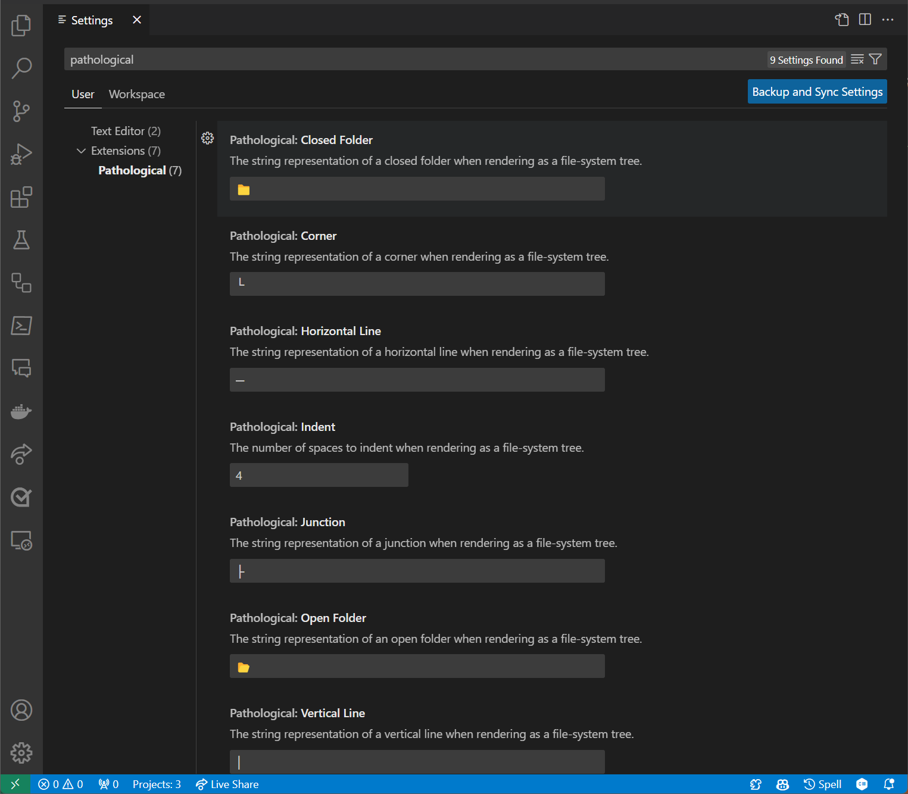

# Pathological

Developer-friendly path utilities for VS Code: copy relative paths between Explorer selections, export folders as an ASCII/Unicode tree or a flat list, and gather quick stats. Fully configurable control characters and indentation.

* Marketplace: [IEvangelist.pathological](https://marketplace.visualstudio.com/items?itemName=IEvangelist.pathological)

## What you can do

* Copy Relative Path between two Explorer items
* Copy as File System Tree (Unicode or ASCII, your choice)
* Copy as Flat List
* Show Pathological Stats (counts, sizes, line totals, unique file types) and copy them

All features are available from the Explorer context menu and the Command Palette.

## Installation

1) Install "Pathological" from the VS Code Marketplace.
2) Reload VS Code if prompted.

## Commands and where to find them

Explorer context menu on a file/folder:

* `pathological.selectUriForRelative`: Select for Relative Path
* `pathological.getRelativePath`: Copy Relative Path for Selected
* `pathological.getAsFileSystemTree`: Copy as File System Tree
* `pathological.getAsFlatList`: Copy as Flat List
* `pathological.getAsFileSystemStats`: Copy as File System Stats
* `pathological.showPathological`: Show Pathological Stats

You can also run these from the Command Palette (<kbd>Ctrl</kbd>+<kbd>Shift</kbd>+<kbd>P</kbd> on Windows/Linux, <kbd>Cmd</kbd>+<kbd>Shift</kbd>+<kbd>P</kbd> on macOS) by searching for:

```text
Pathological
```

## Quick examples

### 1) Copy Relative Path

Step A: Right‑click a source item and choose "Select for Relative Path".

Step B: Right‑click the destination item and choose "Copy Relative Path for Selected".

Example result on Windows:

```text
..\..\..\.github\workflows\publish-nuget.yml
```

If you set the normalized path separator to "/", the copied value becomes:

```text
../../../.github/workflows/publish-nuget.yml
```

> [!TIP]
> While it's not the default, configuring `pathological.normalizedPathSeparator` to `"/"` will ensure consistent path formatting across all operating systems.

### 2) Copy as File System Tree

Given a folder like:

```text
project/
    src/
        index.ts
        utils/
            parse.ts
    README.md
```

Copy as File System Tree produces (with default settings):

```text
└───📂 project
        ├───📂 src
        │   ├─── index.ts
        │   └───📂 utils
        │       └─── parse.ts
        └─── README.md
```

Prefer ASCII? Customize the control characters (see Configuration) to get something like:

```text
/--- [project]
|   +--- [src]
|   |   +--- index.ts
|   |   /--- [utils]
|   |       /--- parse.ts
/--- README.md
```

### 3) Copy as Flat List

For the same folder, this copies a newline‑separated list:

```text
project/src/index.ts
project/src/utils/parse.ts
project/README.md
```

### 4) Show Pathological Stats

Displays a quick summary and copies it to the clipboard. Example fields:

* Path
* Files / Directories
* Total Size
* Total Number Lines
* Unique File Types
* File Tree (inline)

Note: line counts and size require reading files. You can control this with the "pathological.stats" setting.

## How the tree builder works (src/services/tree-builder.ts)

At the core, Pathological renders a folder as text using a small, configurable recursive algorithm:

* `buildTree(node, config)` is a thin wrapper that calls buildFileTree.
* `buildFileTree(node, config, previousTree = "")` walks the node's children. For each child:
  * It detects whether the child is the last among its siblings (isLastChild). This chooses corner vs junction characters.
  * Directories: it prints a line using `toSingleLine(…isDirectory=true, isLeaf=child.isLeaf)` and then recurses into the directory. The next level's prefix is computed by `previousTree` + `toLeadingLine(isLastChild,…)`.
  * Files: it prints a single line using `toSingleLine(…isDirectory=false)`.
* `toLeadingLine(isLast, verticalLine, indent)` returns the vertical "column" to carry through deeper levels using either a vertical bar or a space when the previous level was the last item.
* `toSingleLine(…)` composes one line: chooses corner (`└`) or junction (`├`), repeats horizontal lines (`─`) based on indent, picks an open or closed folder icon for directories (📂 vs 📁), and appends the item's name. It then prepends the accumulated prefix from previous levels.

That's how the algorithm yields a readable, correctly branched tree using only the characters defined by your configuration.

Key configuration properties used here (see below for all):

* openFolder / closedFolder
* horizontalLine / verticalLine
* corner / junction
* indent (how many characters to offset each level)

## Configuration

Open Settings and search for "Pathological", or add to settings.json:

```json
{
    "pathological.closedFolder": "📁",
    "pathological.openFolder": "📂",
    "pathological.verticalLine": "│",
    "pathological.horizontalLine": "─",
    "pathological.corner": "└",
    "pathological.junction": "├",
    "pathological.indent": 4,
    "pathological.stats": false,
    "pathological.filterExpression": "",
    "pathological.normalizedPathSeparator": "/"
}
```

Tips:

* Set `normalizedPathSeparator` to `"/"` to always copy Unix‑style paths.
* Use `filterExpression` (regex) to include/exclude items when generating lists/trees.
* Swap in plain ASCII (e.g., `|`, `-`, `+`, `\\`) if your terminal/font doesn't render box‑drawing characters.

Settings UI preview:



## Development

* Requirements: VS Code 1.82+ and Node 18+
* Build: npm install, then npm run build (or npm run watch for live recompilation)
* Test: npm test
* Debug: press <kbd>F5</kbd> to launch the extension in a new Extension Development Host window
* Package/Publish: vsce package / vsce publish

## Notes and troubleshooting

* Icons not showing or misaligned? Try a font that supports emoji and box‑drawing characters.
* "Copy as File System Tree" appears only on folders in the Explorer.
* Large folders: generating stats can be I/O‑intensive; disable `pathological.stats` or use a `filterExpression`.

## License and sponsorship

Licensed under the MIT license. Issues and PRs are welcome.

Sponsor: [github.com/sponsors/IEvangelist](https://github.com/sponsors/IEvangelist)
