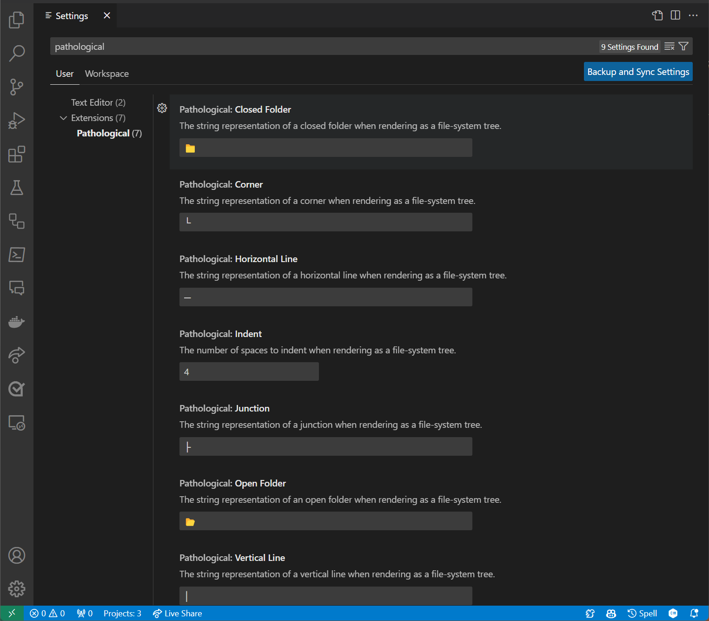

# Pathological

Pathological is a VS Code extension that provides convenient and developer-friendly _path_ APIs. With Pathological, you can copy a selected directory in the **Explorer** as a tree representation with fully customizable control characters. You can also select relative paths between explorer selections.

## Features

The following features are available in Pathological:

### Copy Relative Path

Select the initial target file or folder in the explorer, then select the final target file or folder by right-clicking it and choosing the **`Select for Relative Path`** option. The relative path between the two selections will be copied to your clipboard.

For example, right-clicking on the following file path and choosing the **`Select for Relative Path`**:

```
.\pathological.globbing\src\Pathological.Globbing\Abstractions\IBasePathOption.cs
```

and then right-clicking on the following file path and choosing the **`Copy Relative Path for Selected`** option:

```
.\pathological.globbing\.github\workflows\publish-nuget.yml
```

would copy the following to your clipboard:

```
..\..\..\.github\workflows\publish-nuget.yml
```

> **Note**
> This is following the **`Select for Compare`** and corresponding **`Compare with Selected`**.

### Copy Directory Tree

Pathological allows you to copy the directory tree of the current file to your clipboard. For example, given the following folder structure:

```

Pathological.Globbing/Abstractions/IBasePathOptions.cs
Pathological.Globbing/bin/Debug/net8.0/Pathological.Globbing.deps.json
Pathological.Globbing/bin/Debug/net8.0/PPathological.Globbing.dll
Pathological.Globbing/bin/Debug/net8.0/Pathological.Globbing.xml
Pathological.Globbing/bin/Release/net8.0/Pathological.Globbing.deps.json
Pathological.Globbing/bin/Release/net8.0/PPathological.Globbing.dll
Pathological.Globbing/bin/Release/net8.0/Pathological.Globbing.xml

```

The following is copied to your clipboard:

```

└───📂 Pathological.Globbing
    ├───📂 Abstractions
    │   └─── IBasePathOption.cs
    └───📂 bin
        ├───📂 Debug
        │   └───📂 net8.0
        │       ├─── Pathological.Globbing.deps.json
        │       ├─── Pathological.Globbing.dll
        │       └─── Pathological.Globbing.xml
        └───📂 Release
            └───📂 net8.0
                ├─── Pathological.Globbing.deps.json
                ├─── Pathological.Globbing.dll
                └─── Pathological.Globbing.pdb
```

## Configuration

Pathological is fully configurable. You can change the control characters used to represent the tree, the indentation, and the file and folder icons. You can also change the default behavior of the **`Copy Relative Path`** command to copy the absolute path instead of the relative path.

### Control Characters

The control characters are defined in the `PathologicalConfiguration` type. The default values are:

```json
"pathological": {
    "openFolder": "📂",
    "closedFolder": "📁",
    "indent": 4,
    "horizontalLine": "─",
    "verticalLine": "│",
    "corner": "└",
    "junction": "├",
}
```

Settings can be changed by adding the following to your `settings.json` file, or through the UI:


